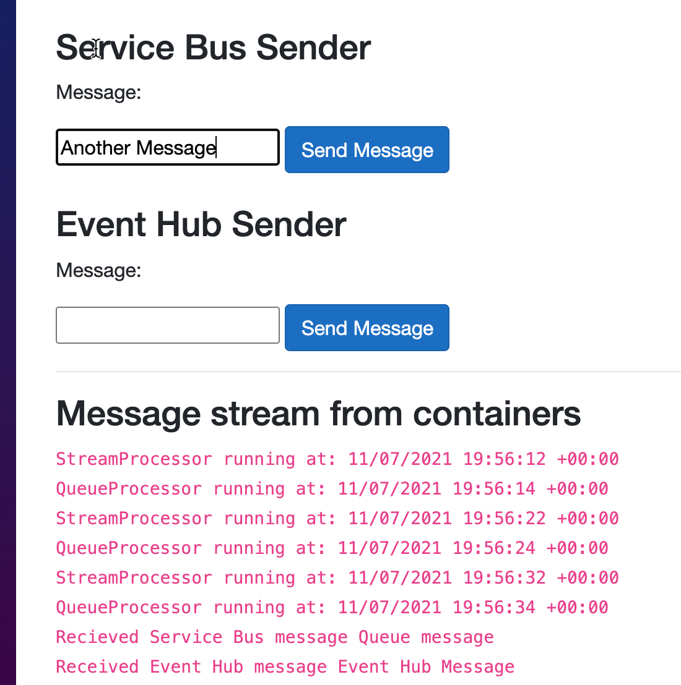

# Azure Container Apps Event Driven sample (dotnet)

Sample of 2 container apps deployed to an environment. One of them processes and scales based on a queue from Azure Service Bus, the other one processes and scales from events from Azure Event Hubs.

Deployment files are written in Bicep and can be found in the `deploy` folder.  The `scale.rules` for each is set based on the [KEDA](https://keda.sh) scalers.

Both containers are written using the .NET 6 worker template.

The sample includes an Azure Static Web app that will allow you drop messages on the queue or event hub, and stream back the data from the containers in real-time using Azure Web PubSub.


### Deploy via GitHub Actions (recommended)
The GitHub Actions will deploy an environment that includes both the with-fqdn and with-dapr versions of the solution.

1. Fork the sample repo
2. Create the following required [encrypted secrets](https://docs.github.com/en/actions/security-guides/encrypted-secrets#creating-encrypted-secrets-for-an-environment) for the sample

  | Name | Value |
  | ---- | ----- |
  | AZURE_CREDENTIALS | The JSON credentials for an Azure subscription. [Learn more](https://docs.microsoft.com/azure/developer/github/connect-from-azure?tabs=azure-portal%2Cwindows#create-a-service-principal-and-add-it-as-a-github-secret) |
  | RESOURCE_GROUP | The name of the resource group to create |
  | PACKAGES_TOKEN | A GitHub personal access token with the `packages:read` scope. [Learn more](https://docs.github.com/en/authentication/keeping-your-account-and-data-secure/creating-a-personal-access-token) |
  | DEBUG_SITE | Set to `true` for initial deploy. After initial deploy, set to `false`.|
  | SWA_TOKEN | (optional if using the debug and view logs) A GitHub personal access token with the `repo` scope. This is used by Azure Static Web Apps to generate the secrets and actions for the static web app publish. Can be very short lived (1 day) as only used for initial create. [Learn more](https://docs.github.com/en/authentication/keeping-your-account-and-data-secure/creating-a-personal-access-token) |

Once the solution has deployed, open the resource group and navigate to the create `debug-site` Azure Static Web App and browse to the URL.  You will be presented with a site that will let you send messages securely to the Event Hub and Service Bus queue, and view logs from the containers in real time via Azure Web PubSub.

### Deploy via Bicep
You can also deploy the solution at anytime using the Azure CLI.

1. Clone this repo and navigate to the folder
2. Run the following CLI command (with appropiate values for $variables)
  ```cli
  az group create -n $resourceGroup -l canadacentral
  az deployment group create -g $resourceGroup -f ./deploy/main.bicep \
    -p \
    serviceBusImage='ghcr.io/jeffhollan/container-apps-dotnet-eventing/servicebus:main' \
    eventHubImage='ghcr.io/jeffhollan/container-apps-dotnet-eventing/eventhub:main' \
    registry=ghcr.io \
    registryUsername=$githubUsername \
    registryPassword=$githubPackagesToken